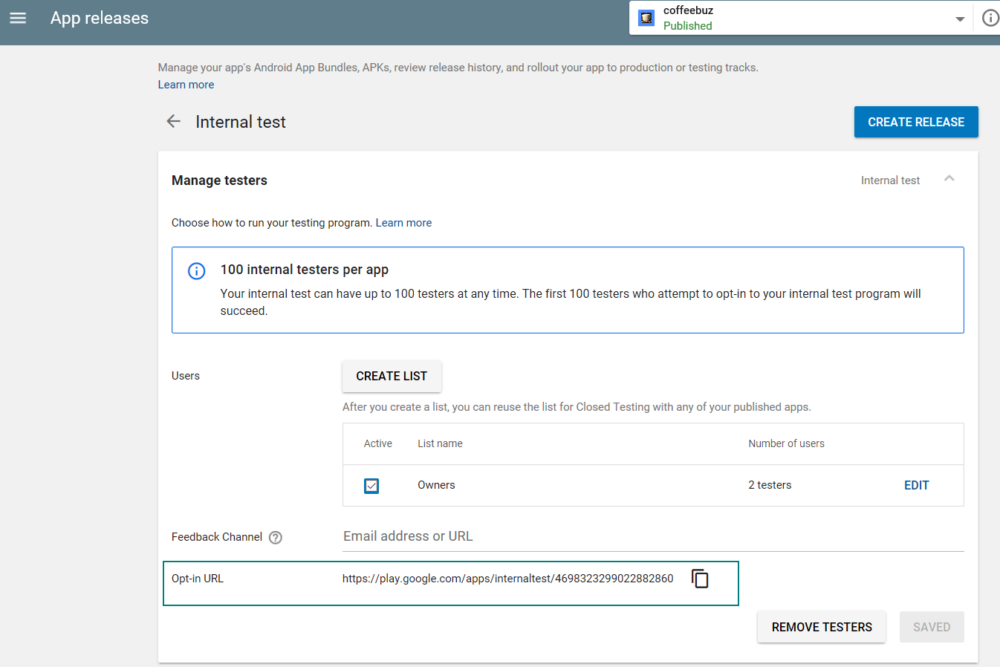

# Internal Test Track

- Add testers list first by going to Google Play Console
    Settings > Manage Testers
- Manage tester for a release by clicking on `Manage`  ( App releases - Internal test track )
    - select the tester list

- Ensure the following is correctly setup ( green tick )
    - Store listing
    - Content rating
    - Pricing & distribution

    Tool to generate icon google play is happy about -  https://romannurik.github.io/AndroidAssetStudio/index.html

- Click `Review` followed by `Start rollout to internal test`
    ( if `Start rollout to internal test` is greyed out, ensure the setup step before is done correctly )

- It takes approximately half an hour for the app to be published

- Return to Manage internal test to copy out the opt-in url 

# Publishing API Reference 
- Document : https://developers.google.com/android-publisher/api-ref/
- Sample : https://github.com/googlesamples/android-play-publisher-api/tree/master/v2/python